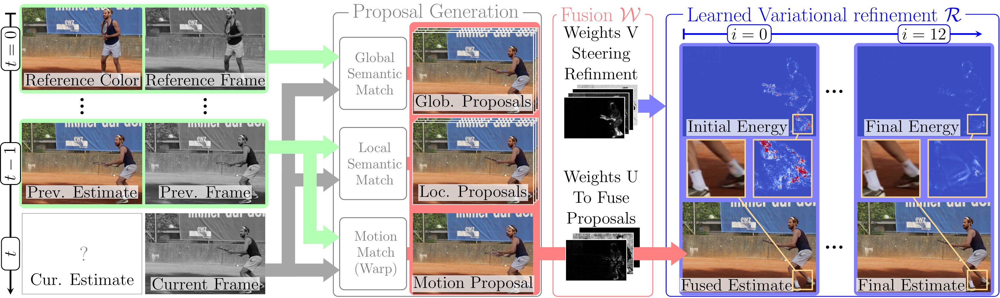
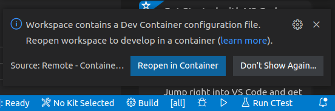

# LVVCP - Learned Variational Video Color Propagation

This repostiory contains the code for the work on LVVCP - 'Learned variational video color propagation'




## Building and running the examples
It is recommended to run the examples inside the provided docker container using VSCode.
This will provide you with a complete environment, as well as run and debug options.

You will need:
   - Docker2
   - VSCode: <br>
      For more background information on using VSCode to Develope inside a container see [Developing inside a Container](https://code.visualstudio.com/docs/remote/containers)
   - These VSCode extensions:
     - The extension for 'Remote Development'
     - The docker extension for VSCode installed
   

Once you have the above prerequisites setup **clone the repository recursively**, which ensures that sub-modules are also cloned.

  ```bash
  cd <workdir>
  git clone https://github.com/VLOGroup/LVVCP --recursive
  ```
  
  Now open the workspace in VSCode by calling:
  ```
  code LVVCP/LVVCP_gitlab.code-workspace
  ```
  VSCode should automatically discover the `.devcontainer/devcontainer.json` file that describes the docker setup.
  Once it detected the settings it will ask you if you want to: Reopen the worksapce to develop in a container - click 'Reopen in Container'<br>
  


  The first build run can take quite long - click on the message details message on the lower right corner to get details (or error messages)
  
  ## Running a demo
  
  Once the container is up and running you can run an example by calling:
  ```bash
  ./demo_scripts/demo_LVVCP_scootergray.sh 
  ```
  The above script runs the best model from the paper, i.e. the full model with multi-model training, using Motion, Local and Global color proposal types. The Global and Local types use 3 candidates each per pixel.
  TDV refinement is set to 12 iterations.

  Alternatively, we also provide an additional CUDA sampling operator, that greatly speeds up the process and reduces GPU memory requirements at the same time, with very similar qualitative performance.
  ```bash
  ./demo_scripts/demo_LVVCP_scootergray_cuda.sh 
  ```

  You can run a quick check to see if the results are plausible on your setup.
  For the std. version (without the cuda sample_cv operator):
  ```python
  python numerical_quick_check.py --sample_cv=0 --res_path=out_val/<results_folder_name>/
  ```
  For the version with the cuda sample_cv operator:
  ```
  python numerical_quick_check.py --sample_cv=1 --res_path=out_val/<results_folder_name>/
  ```


If you use this code please consider citing:

```bibtex
@InProceedings{HofingerKobler22,
  Title     = {Learned Variational Video Color Propagation},
  Author    = {Hofinger, Markus and Kobler, Erich and Effland, Alexander and Pock, Thomas},
  Booktitle = {Computer Vision -- ECCV 2022. Lecture Notes in Computer Science},
  Year      = {2022}
}

@InProceedings{KoEf20,
  Title     = {Total Deep Variation for Linear Inverse Problems},
  Author    = {Kobler, Erich and Effland, Alexander and Kunisch, Karl and Pock, Thomas},
  Booktitle = {IEEE Conference on Computer Vision and Pattern Recognition},
  Year      = {2020}
}
```


## Licences:
We release our part of the code under MIT licence.
However, please be aware that parts that we use, like RAFT, the VGG or ResNet parts come from other authors - please verify their licenses.


## FAQ
  - What is the 'restore_research_code_artifacts' option?
     During refactoring of the research code the following bugs have been found and frozen for reproducibility reasons:
     - The eval() signal was not passed all the way to the VGGbn backbone (used a list instead of torch.nn.ModuleList), hence the batchnorm was still in training mode.
     - The color candindate sampling for optical flow multiplied out of image tensors with 0, however, correct is to set those pixels to 0.5 (our value for gray and 0 color in Lab)
     
